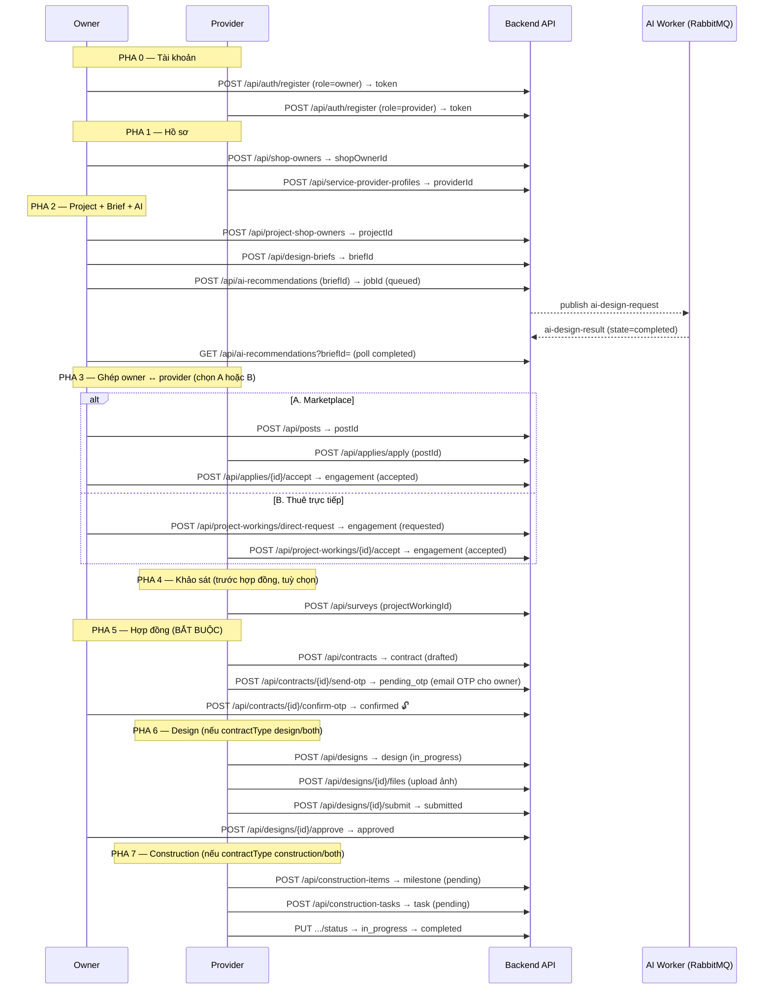

# Luồng API: Login → Construct (dành cho FE)

> Tài liệu mô tả **luồng chính (happy path)** từ lúc đăng nhập đến khi thi công (construction),
> kèm **input / output / cách hoạt động** của từng API.
>
> **2 lưu ý trạng thái hệ thống hiện tại (bản test cho FE):**
> 1. **AI đã được MỞ KHOÁ cho mọi tài khoản** — không bị chặn bởi payment/subscription.
>    Gate phí nền tảng trong `AiRecommendationService.EnsureAiAccessAsync` đang `return;` sớm
>    (có `TODO(rào tạm)`). ⇒ Gọi AI **không cần** mua gói.
> 2. **Contract vẫn BẮT BUỘC** trước khi tạo design / construction. Luồng đi qua bước ký hợp đồng
>    thật bằng **OTP gửi email cho owner** (`drafted → pending_otp → confirmed`). `confirmed` là
>    mốc mở khoá tạo design & construction.

---

## 0. Thông tin chung

| Mục | Giá trị |
|---|---|
| Base URL (dev) | `http://localhost:5290` (hoặc `https://localhost:7034`) |
| Kiểu dữ liệu | JSON, key **camelCase** (request bind không phân biệt hoa/thường) |
| Auth | Header `Authorization: Bearer {accessToken}` cho **mọi** API trừ `api/auth/*` |
| Access token | JWT, hết hạn **15 phút** |
| Refresh token | Chuỗi random, hết hạn **7 ngày**, xoay vòng mỗi lần refresh |
| Phân trang | List trả `PaginationResponse<T>` (xem mục 0.3) |

### 0.1. Actor (vai trò)

Role gán khi đăng ký (`account.role`): `owner` | `provider` | `admin`.

- **owner** (chủ quán) → có hồ sơ `shop-owner`, tạo `project`, `design-brief`, chạy AI, đăng bài / thuê provider, **duyệt design**, **ký OTP hợp đồng**, nghiệm thu.
- **provider** (nhà cung cấp) → có hồ sơ `service-provider-profile` với **capability**: `designer` | `constructor` | `both`. Nhận việc, khảo sát, tạo hợp đồng, làm design (nếu designer/both), thi công (nếu constructor/both).
- Designer/Constructor **là capability của provider**, KHÔNG phải role riêng.

> Backend hiện **chưa** chặn quyền theo role ở từng endpoint (chỉ cần token hợp lệ là gọi được).
> FE tự điều hướng UI theo role. "Ai gọi" bên dưới là **quy ước nghiệp vụ**, không phải ràng buộc code.

### 0.2. Model lỗi (GlobalExceptionHandler)

Mọi lỗi trả `ProblemDetails` (RFC 7807):

```json
{
  "status": 409,
  "title": "Conflict",
  "detail": "Engagement chưa có contract 'confirmed' — ký hợp đồng trước khi tạo design.",
  "instance": "POST /api/designs",
  "traceId": "...",
  "exceptionType": "System.InvalidOperationException"
}
```

| Exception (ở Service) | HTTP | Ý nghĩa |
|---|---|---|
| `ArgumentException` | 400 | Tham số/enum không hợp lệ |
| `UnauthorizedAccessException` | 401 | Token sai / login thất bại |
| `KeyNotFoundException` | 404 | Không tìm thấy tài nguyên |
| `InvalidOperationException` | 409 | Vi phạm nghiệp vụ / sai state machine / trùng dữ liệu |
| Khác | 500 | Lỗi hệ thống |

### 0.3. Shape phân trang

```json
{
  "items": [ /* ... */ ],
  "pageNumber": 1,
  "pageSize": 10,
  "totalItems": 42,
  "totalPages": 5,
  "hasPrevious": false,
  "hasNext": true
}
```

---

## 1. Sơ đồ luồng tổng thể



**Trục trung tâm** của mọi việc sau khi ghép là `projectWorkingId` (engagement / "project_provider"):
survey, contract, design, construction_item đều tham chiếu về nó.

---

## 2. Bảng tóm tắt các bước

| # | Bước | Method & Endpoint | Ai gọi | Tiền đề |
|---|---|---|---|---|
| 1 | Đăng ký | `POST /api/auth/register` | Owner, Provider | — |
| 2 | Đăng nhập | `POST /api/auth/login` | Tất cả | Có account |
| 3 | Hồ sơ owner | `POST /api/shop-owners` | Owner | account role=owner |
| 4 | Hồ sơ provider | `POST /api/service-provider-profiles` | Provider | account role=provider |
| 5 | Tạo project | `POST /api/project-shop-owners` | Owner | có shopOwnerId |
| 6 | Tạo brief | `POST /api/design-briefs` | Owner | có projectId (1 brief/project) |
| 7 | Chạy AI | `POST /api/ai-recommendations` | Owner | có briefId + project đủ field |
| 8 | Poll AI | `GET /api/ai-recommendations?briefId=` | Owner | — |
| 9A | Đăng bài | `POST /api/posts` | Owner | có projectId |
| 10A | Ứng tuyển | `POST /api/applies/apply` | Provider | post open + capability khớp |
| 11A | Duyệt hồ sơ | `POST /api/applies/{id}/accept` | Owner | apply pending → tạo **engagement (accepted)** |
| 9B | Thuê trực tiếp | `POST /api/project-workings/direct-request` | Owner | capability khớp → **engagement (requested)** |
| 10B | Provider nhận | `POST /api/project-workings/{id}/accept` | Provider | engagement requested → **accepted** |
| 12 | Khảo sát | `POST /api/surveys` | Provider | engagement accepted + contractType có design |
| 13 | Tạo hợp đồng | `POST /api/contracts` | Provider | engagement accepted |
| 14 | Gửi OTP | `POST /api/contracts/{id}/send-otp` | Provider | contract drafted/pending_otp |
| 15 | Xác nhận OTP | `POST /api/contracts/{id}/confirm-otp` | Owner | contract pending_otp → **confirmed 🔓** |
| 16 | Tạo design | `POST /api/designs` | Provider (designer) | engagement accepted + **contract confirmed** + contractType design/both |
| 17 | Upload ảnh | `POST /api/designs/{id}/files` | Provider | design chưa approved |
| 18 | Nộp design | `POST /api/designs/{id}/submit` | Provider | design in_progress + có ≥1 ảnh |
| 19 | Duyệt design | `POST /api/designs/{id}/approve` | Owner | design submitted |
| 20 | Tạo milestone | `POST /api/construction-items` | Provider (constructor) | engagement accepted + **contract confirmed** + contractType construction/both |
| 21 | Tạo task | `POST /api/construction-tasks` | Provider | milestone chưa completed |
| 22 | Đổi trạng thái thi công | `PUT /api/construction-items/{id}/status`, `PUT /api/construction-tasks/{id}/status` | Provider | pending→in_progress→completed |

> **Tối giản để test construct nhanh:** chọn engagement `contractType = both` + provider `capability = both`
> → 1 luồng chạy thẳng từ khảo sát → hợp đồng → design → construction. Nếu tách designer/constructor
> riêng thì tạo **2 engagement** (mỗi bên 1 hợp đồng); bên constructor xem bản vẽ đã duyệt qua
> `GET /api/project-workings/{id}/overview`.

---

## 3. Chi tiết từng API

Ký hiệu: 🔓 = mở khoá bước sau. Field có `?` = optional.

### PHA 0 — Tài khoản

#### 1) Đăng ký — `POST /api/auth/register`
Tạo account + trả token luôn (đăng ký xong là đã login).

**Input**
```json
{
  "email": "owner@demo.com",
  "password": "Passw0rd!",
  "phone": "0900000001",
  "role": "owner"
}
```
- `role`: `owner` | `provider` | `admin`. `password` ≥ 8 ký tự.

**Output `200`**
```json
{
  "accessToken": "eyJhbGci...",
  "refreshToken": "b64string...",
  "accountId": 1,
  "email": "owner@demo.com",
  "role": "owner"
}
```
- Lỗi: `409` email đã dùng · `400` role sai.

> Làm 2 lần: 1 account `owner`, 1 account `provider`. Ghi lại `accountId` mỗi bên.

#### 2) Đăng nhập — `POST /api/auth/login`
**Input** `{ "email": "...", "password": "..." }` → **Output** giống `register`.
- Lỗi: `401` sai email/mật khẩu.

#### (phụ) Refresh — `POST /api/auth/refresh`
**Input** `{ "refreshToken": "..." }` → cấp cặp token mới, thu hồi token cũ.

---

### PHA 1 — Hồ sơ

#### 3) Tạo hồ sơ owner — `POST /api/shop-owners`  *(cần Bearer)*
**Input**
```json
{
  "accountId": 1,
  "fullName": "Nguyen Van Owner",
  "shopName": "Cafe Demo",
  "phone": "0900000001",
  "address": "123 Lê Lợi, Q1, HCM"
}
```
**Output `201`**
```json
{ "id": 10, "accountId": 1, "fullName": "Nguyen Van Owner", "shopName": "Cafe Demo",
  "phone": "0900000001", "address": "123 Lê Lợi, Q1, HCM", "createdAt": "...", "updatedAt": "..." }
```
- `id` này là **`shopOwnerId`** — dùng làm `ownerId` khi tạo project.
- Lỗi: `404` account không tồn tại · `400` account không phải role owner · `409` account đã có hồ sơ.

#### 4) Tạo hồ sơ provider — `POST /api/service-provider-profiles`  *(cần Bearer)*
**Input**
```json
{
  "accountId": 2,
  "displayName": "Studio ABC",
  "providerType": "company",
  "capability": "both",
  "bio": "Thiết kế & thi công quán cafe",
  "companyTaxCode": "0312345678",
  "yearsExperience": 6,
  "portfolioHeadline": "20+ quán đã bàn giao"
}
```
- `providerType`: `individual` | `company`. `capability`: `designer` | `constructor` | `both`.

**Output `201`**
```json
{ "id": 5, "accountId": 2, "displayName": "Studio ABC", "providerType": "company",
  "capability": "both", "isVerified": false, "avgRating": 0, "createdAt": "...", "updatedAt": "..." }
```
- `id` này là **`serviceProviderProfileId`**.
- Lỗi: `404` account không tồn tại · `400` account không phải role provider / enum sai · `409` đã có hồ sơ.

---

### PHA 2 — Project + Brief + AI (owner)

#### 5) Tạo project — `POST /api/project-shop-owners`
**Input**
```json
{
  "ownerId": 10,
  "name": "Cafe Demo - Chi nhánh 1",
  "address": "123 Lê Lợi, Q1, HCM",
  "areaM2": 80,
  "budget": 500000000
}
```
- `ownerId` = `shopOwnerId` (bước 3). `areaM2`, `budget` phải > 0 để chạy AI được.

**Output `201`**
```json
{ "id": 20, "ownerId": 10, "name": "Cafe Demo - Chi nhánh 1", "address": "...",
  "areaM2": 80, "budget": 500000000, "status": "briefed",
  "providers": [], "openPosts": [], "openFor": [], "createdAt": "...", "updatedAt": "..." }
```
- `id` = **`projectShopOwnerId`** (= "projectId" trong nhiều DTO).

#### 6) Tạo design brief — `POST /api/design-briefs`
**Input**
```json
{
  "projectShopOwnerId": 20,
  "targetCustomer": "Nhân viên văn phòng, sinh viên",
  "style": "modern",
  "mood": "cozy, ấm cúng",
  "seatCount": 40,
  "timeline": "2 tháng",
  "brandNote": "Tông nâu gỗ, logo tối giản",
  "businessModel": "specialty_cafe",
  "businessGoals": "Tối ưu chỗ ngồi, quầy bar nổi bật",
  "operationNote": "Cao điểm 7-9h sáng"
}
```
- **1 project chỉ 1 brief** (unique). `targetCustomer`, `style`, `mood` bắt buộc.

**Output `201`** → có `id` = **`briefId`**.
- Lỗi: `404` project không tồn tại · `409` project đã có brief.

#### 7) Chạy AI design — `POST /api/ai-recommendations`  *(AI ĐÃ MỞ KHOÁ)*
Đẩy job vào RabbitMQ, worker xử lý **bất đồng bộ**. Trả về ngay `202` với trạng thái `queued`.

**Input**
```json
{
  "briefId": 30,
  "mustHaveZones": ["counter", "seating_area", "restroom"],
  "niceToHaveZones": ["outdoor_seating"],
  "notes": "Ưu tiên ánh sáng tự nhiên",
  "generateImage": true,
  "imageView": "PerspectiveInterior",
  "detailLevel": "Medium",
  "alternativesCount": 1,
  "referenceImageUrls": []
}
```
- Chỉ `briefId` bắt buộc; phần còn lại có default. Hầu hết dữ liệu tự lấy từ project + brief.
- `imageView`: `Isometric` | `TopDown` | `PerspectiveInterior` | `FrontElevation`. `detailLevel`: `Low|Medium|High`.

**Output `202`**
```json
{ "id": 100, "jobId": "d4f...guid", "projectId": "proj-20", "userId": "1",
  "state": "queued", "createdAt": "...", "attempts": 0 }
```
- Lỗi: `404` brief/project không tồn tại · `409` project thiếu field (name/address/areaM2/budget).
- **Phụ thuộc:** cần RabbitMQ broker + AI worker đang chạy thì `state` mới tiến `queued → processing → completed`.

#### 8) Poll kết quả AI — `GET /api/ai-recommendations?briefId=30&pageNumber=1&pageSize=10`
Trả `PaginationResponse<AiRecommendationResponse>`. FE poll đến khi `state == "completed"`.

**Output (rút gọn)**
```json
{
  "items": [{
    "id": 100, "briefId": 30, "jobId": "d4f...", "state": "completed",
    "planConceptName": "Cozy Wood Specialty", "planSummary": "...",
    "layoutWidth": 10, "layoutHeight": 8, "layoutUnit": "m",
    "layoutZones": [ { "id": "counter", "label": "Quầy pha chế" } ],
    "fitoutMinVnd": 300000000, "fitoutMaxVnd": 450000000,
    "imageArtifactUrl": "https://.../render.png",
    "seatCapacityRecommendation": 38, "completedAt": "..."
  }],
  "pageNumber": 1, "pageSize": 10, "totalItems": 1, "totalPages": 1
}
```
- `state`: `queued` | `processing` | `completed` | `failed` (chuỗi, không phải enum). Lỗi worker nằm ở `lastError`.

---

### PHA 3 — Ghép owner ↔ provider

> Kết quả cả 2 cách đều là **engagement (`project-working`) `status = accepted`** — đầu vào cho mọi bước sau.
> Chọn **A** (marketplace, đăng bài tuyển) hoặc **B** (thuê trực tiếp).

#### — Cách A: Marketplace —

#### 9A) Owner đăng bài — `POST /api/posts`
**Input**
```json
{
  "projectShopOwnerId": 20,
  "serviceKind": "both",
  "title": "Cần thiết kế & thi công quán 80m2",
  "description": "Chi tiết yêu cầu...",
  "submissionDeadline": "2026-08-15T00:00:00Z"
}
```
- `serviceKind`: `design` | `construction` | `both`. `submissionDeadline` (nếu có) phải ở tương lai.

**Output `201`** → có `id` = **`postId`**, `status: "open"`.

#### (provider tìm bài) `GET /api/posts?serviceKind=both&status=open&search=`
Trả list post `open` (tự ẩn bài quá hạn).

#### 10A) Provider ứng tuyển — `POST /api/applies/apply`
Hồ sơ provider **lấy theo token** (không gửi id).

**Input**
```json
{ "postId": 40, "proposal": "Đề xuất của tôi...", "estimatedDurationDays": 45 }
```
- Điều kiện: post `open` + còn hạn + **capability provider khớp `serviceKind`** (`both` khớp mọi loại) + chưa nộp trùng.

**Output `201`** → `id` = **`applyId`**, `status: "pending"`.
- Lỗi: `404` post không tồn tại · `404` account chưa có hồ sơ provider · `409` post đóng/quá hạn/đã nộp · `409` capability không khớp.

#### 11A) Owner duyệt hồ sơ — `POST /api/applies/{applyId}/accept`
Atomic: accept hồ sơ → **tạo engagement `accepted`** → đóng post (`closed`) → auto-reject hồ sơ pending khác.

**Output `200`** = **ProjectWorkingResponse** (engagement):
```json
{
  "id": 60, "projectShopOwnerId": 20, "projectName": "Cafe Demo - Chi nhánh 1",
  "serviceProviderProfileId": 5, "providerDisplayName": "Studio ABC",
  "applyId": 50, "contractType": "both", "status": "accepted",
  "createdAt": "...", "updatedAt": "..."
}
```
- `id` = **`projectWorkingId`** (engagement). `contractType` kế thừa `serviceKind` của post.

#### — Cách B: Thuê trực tiếp —

#### (owner tìm provider) `GET /api/service-provider-profiles?capability=both&isVerified=&search=`
Sắp theo `avgRating` giảm dần. Lọc `designer`/`constructor` tự gồm cả provider `both`.

#### 9B) Owner gửi lời mời — `POST /api/project-workings/direct-request`
**Input**
```json
{
  "projectShopOwnerId": 20,
  "serviceProviderProfileId": 5,
  "contractType": "both",
  "requestMessage": "Mời anh/chị nhận dự án Cafe Demo"
}
```
- `contractType` phải khớp capability provider. Không thuê trùng khi đã có engagement đang hoạt động.

**Output `201`** = ProjectWorkingResponse, `status: "requested"`, `applyId: null`.

#### 10B) Provider nhận việc — `POST /api/project-workings/{id}/accept`
`requested → accepted`. (Từ chối: `POST .../{id}/reject`.)

**Output `200`** = ProjectWorkingResponse, `status: "accepted"`. → có **`projectWorkingId`**.

---

### PHA 4 — Khảo sát mặt bằng (tuỳ chọn, TRƯỚC hợp đồng)

#### 12) Provider tạo survey — `POST /api/surveys`
**Không** cần hợp đồng — chỉ cần engagement `accepted` + `contractType` có pha design (`design`/`both`).

**Input**
```json
{
  "projectWorkingId": 60,
  "conditionNote": "Mặt bằng 80m2, trần 3.5m, 2 mặt tiền...",
  "reportUrl": "provider/5/2026/07/9f3c…pdf",
  "createdBy": 2
}
```
- `createdBy` = accountId của provider (optional).
- `reportUrl` = **objectName** trả về từ `POST /api/files`; response kèm `reportViewUrl` = URL public để xem/tải.

**Output `201`** → `version` tự tăng 0.1 theo engagement (0.1, 0.2, …).
- Lỗi: `409` engagement không `accepted` · `409` contractType = construction (không có pha khảo sát).

---

### PHA 5 — Hợp đồng (BẮT BUỘC — mở khoá design & construction)

#### 13) Provider tạo hợp đồng — `POST /api/contracts`
**Input**
```json
{
  "projectWorkingId": 60,
  "title": "Hợp đồng thiết kế & thi công Cafe Demo",
  "partyInfo": "Bên A: ... / Bên B: ...",
  "terms": "Điều khoản...",
  "agreedValue": 480000000,
  "documentUrl": "provider/5/2026/07/9f3c…pdf"
}
```
- `documentUrl` = **objectName** trả về từ `POST /api/files`; response kèm `documentViewUrl` = URL public để xem/tải.

**Output `201`** → `id` = **`contractId`**, `status: "drafted"`.
- Điều kiện: engagement `accepted` + chưa có contract `confirmed`.

#### 14) Gửi OTP ký — `POST /api/contracts/{contractId}/send-otp`
Sinh OTP 6 số (sống 5 phút), **gửi email cho owner** của engagement, `drafted → pending_otp`.
Gọi lại khi mã cũ hết hạn (cấp mã mới, giữ `pending_otp`).

**Output `200`** = ContractResponse (`status: "pending_otp"`, `otpExpiresAt` có giá trị). **Không** trả `otpCode`.
- Lỗi: `409` contract đã confirmed/cancelled · `409` không tìm được email owner.
- **Phụ thuộc:** cần EmailService (Gmail API) cấu hình chạy được.

#### 15) Owner xác nhận OTP — `POST /api/contracts/{contractId}/confirm-otp`  🔓
**Input**
```json
{ "otpCode": "123456", "confirmedBy": 1 }
```
- `otpCode` lấy từ email. `confirmedBy` = accountId của owner.

**Output `200`** = ContractResponse (`status: "confirmed"`, `confirmedAt`, `confirmedBy`).
→ **Từ đây engagement mới tạo được design & construction.**
- Lỗi: `409` OTP sai/hết hạn · `409` sai state · `404` account confirmedBy không tồn tại.

> **Muốn tạm bỏ bước hợp đồng** (nếu email chưa chạy): xem mục 5 — cần mở guard trong code
> (`DesignService` / `ConstructionItemService`). Bản hiện tại **giữ guard**, nên phải làm bước 13–15.

---

### PHA 6 — Design (khi contractType = design | both)

Vòng đời design: `in_progress → submitted → approved`; hoặc `submitted → revision → in_progress → …`

#### 16) Provider tạo design — `POST /api/designs`
**Input**
```json
{ "projectWorkingId": 60, "title": "Concept chính", "type": "concept", "createdBy": 2 }
```
- `type`: `concept` | `layout_2d` | `render_3d` | `technical_drawing`.

**Output `201`** → `id` = **`designId`**, `version: 0.1`, `status: "in_progress"`.
- Lỗi: `409` **chưa có contract confirmed** · `409` engagement không accepted · `409` contractType=construction.

#### 17) Upload ảnh/bản vẽ — `POST /api/designs/{designId}/files`  *(multipart/form-data)*
Form fields: `file` (bắt buộc), `caption?`, `uploadedBy?` (accountId).

**Output `201`** = DesignImageResponse (`id`, `imageUrl`, `viewUrl`, `caption`).
- `imageUrl` = **objectName** trên bucket (giá trị lưu DB), `viewUrl` = **URL public tuyệt đối** để hiển thị:
  `https://storage.googleapis.com/{bucket}/{objectName}` — FE dùng thẳng làm `img src`, không cần token.
- `viewUrl` có ở **mọi** response chứa ảnh design (GET list/detail lẫn lúc upload), không chỉ response upload.
- Lỗi: `409` design đã approved (không thêm file). Xoá file: `DELETE /api/designs/{id}/files/{fileId}`.

#### 18) Nộp duyệt — `POST /api/designs/{designId}/submit`
`in_progress → submitted`. **Bắt buộc có ≥ 1 ảnh.**
- Lỗi: `409` design không in_progress · `409` chưa có ảnh.

#### 19) Owner duyệt / yêu cầu sửa
- Duyệt: `POST /api/designs/{id}/approve` → `approved`.
- Yêu cầu sửa: `POST /api/designs/{id}/request-revision` body `{ "reason": "..." }` → `revision`.
- Provider sửa: `POST /api/designs/{id}/start-revision` → `in_progress`, `version += 0.1`.

**Output** = DesignResponse, ví dụ khi approved:
```json
{ "id": 70, "projectWorkingId": 60, "title": "Concept chính", "version": 0.1,
  "type": "concept", "status": "approved",
  "images": [ {
    "id": 1,
    "imageUrl": "provider/5/2026/07/9f3c…png",
    "viewUrl": "https://storage.googleapis.com/smartcoffeebuilder_bucket/provider/5/2026/07/9f3c…png",
    "caption": "..." } ],
  "createdAt": "...", "updatedAt": "..." }
```
> FE hiển thị ảnh bằng **`viewUrl`** (`imageUrl` chỉ là objectName để BE thao tác trên bucket).

---

### PHA 7 — Construction (khi contractType = construction | both)

Thi công **2 cấp**: `construction_item` (milestone, tự lồng qua `parentId`) → `construction_task` (task, có ảnh hiện trường). Cả hai dùng `ItemStatus`: `pending → in_progress → completed`.

#### 20) Tạo milestone — `POST /api/construction-items`
**Input**
```json
{
  "projectWorkingId": 60,
  "parentId": null,
  "name": "Phần thô",
  "description": "Xây tường, điện nước âm",
  "category": "Kết cấu",
  "estimateAt": "2026-09-01",
  "createdBy": 2
}
```
**Output `201`** → `id` = **`constructionItemId`**, `status: "pending"`.
- Lỗi: `409` **chưa có contract confirmed** · `409` engagement không accepted · `409` contractType=design · `404` parent không cùng engagement.

#### 21) Tạo task trong milestone — `POST /api/construction-tasks`
**Input**
```json
{
  "constructionItemId": 80,
  "name": "Đi dây điện tầng 1",
  "description": "...",
  "imageUrl": "provider/5/2026/07/9f3c…jpg",
  "estimateAt": "2026-09-05",
  "createdBy": 2
}
```
- `imageUrl` = **objectName** ảnh hiện trường trả về từ `POST /api/files/images`; response kèm
  `imageViewUrl` = URL public để hiển thị.

**Output `201`** → `status: "pending"`.
- Lỗi: `409` milestone đã completed.

#### 22) Cập nhật tiến độ
- Milestone: `PUT /api/construction-items/{id}/status` body `{ "status": "in_progress" }` rồi `{ "status": "completed" }`.
- Task: `PUT /api/construction-tasks/{id}/status` tương tự.
- **Chỉ tiến, không lùi**: `pending → in_progress → completed`. Khi `completed` tự set `actualAt`.
- Lỗi: `409` transition sai (vd nhảy thẳng pending→completed) · `400` status không hợp lệ.

**Output** = ConstructionItemResponse / ConstructionTaskResponse:
```json
{ "id": 80, "projectWorkingId": 60, "parentId": null, "name": "Phần thô",
  "category": "Kết cấu", "estimateAt": "2026-09-01", "actualAt": "2026-09-03",
  "status": "completed", "createdAt": "...", "updatedAt": "..." }
```

---

### PHA 8 — Kết thúc (tuỳ chọn)

- Nghiệm thu engagement: `PUT /api/project-workings/{id}/status` body `{ "status": "completed" }`
  — **cần contract confirmed** (đã có). Mở khoá review.
- Xem tổng quan engagement: `GET /api/project-workings/{id}/overview`
  — bên design nhận brief + AI plan; bên construction-only nhận danh sách bản vẽ đã `approved`.

---

## 4. Bảng enum tham chiếu

| Enum | Giá trị | Ghi chú |
|---|---|---|
| `AccountRole` | owner, provider, admin | role tài khoản |
| `Capability` | designer, constructor, both | năng lực provider |
| `ServiceKind` | design, construction, both | `post.serviceKind` & `engagement.contractType` |
| `ProviderStatus` (engagement) | requested, accepted, rejected, completed, terminated | `requested→accepted\|rejected`; `accepted→completed\|terminated` |
| `ApplicationStatus` (apply) | pending, accepted, rejected | |
| `PostStatus` | open, closed, cancelled | |
| `ContractStatus` | drafted, pending_otp, confirmed, cancelled | `confirmed` = mở khoá design/construction |
| `DesignStatus` | in_progress, submitted, revision, approved | |
| `DesignType` | concept, layout_2d, render_3d, technical_drawing | |
| `ItemStatus` (item & task) | pending, in_progress, completed | chỉ tiến, không lùi |
| AI `state` (chuỗi) | queued, processing, completed, failed | KHÔNG phải enum |

---

## 5. Ghi chú quan trọng cho FE

1. **`projectWorkingId` là chìa khoá** — lưu lại sau bước accept engagement; mọi API survey/contract/design/construction đều cần nó.
2. **Thứ tự bắt buộc để construct:** engagement `accepted` → contract `confirmed` → mới tạo được design/construction. Survey là ngoại lệ (làm trước hợp đồng).
3. **AI bất đồng bộ** — POST trả `queued` ngay, phải poll `GET /api/ai-recommendations?briefId=` tới `state=completed`. Cần worker + RabbitMQ chạy.
4. **AI không bị chặn payment** (bản test). Nếu sau này bật lại gate, owner gói free sẽ nhận `409` khi gọi AI.
5. **Token hết hạn 15'** → dùng `POST /api/auth/refresh` để lấy token mới, đừng bắt user login lại.
6. Nhiều DTO dùng field `createdBy`/`confirmedBy`/`uploadedBy` = **accountId** (không phải profileId) — optional trừ `confirmedBy`.
7. **Ảnh & file (GCS)** — quy ước thống nhất toàn API:
   - Upload trước qua `POST /api/files` (mọi định dạng) hoặc `POST /api/files/images` (chỉ ảnh) → nhận
     `{ objectName, url, contentType, sizeBytes }`.
   - **Gửi `objectName`** vào các field lưu file khi POST/PUT (không gửi URL đầy đủ).
   - Response luôn kèm **URL public tuyệt đối** (bucket public-read, không hết hạn, không cần token):

     | Response | Field lưu (objectName) | Field hiển thị (URL public) |
     |---|---|---|
     | DesignImage | `imageUrl` | `viewUrl` |
     | ConstructionTask | `imageUrl` | `imageViewUrl` |
     | Issue | `issueImage`, `confirmImage` | `issueImageViewUrl`, `confirmImageViewUrl` |
     | Survey | `reportUrl` | `reportViewUrl` |
     | Contract | `documentUrl` | `documentViewUrl` |

     > `AiRecommendation` (`imageArtifactUrl`, `imageReferenceUrls`) do worker AI ghi — BE giữ nguyên,
     > không thêm field view URL. FE tự xử lý link đó như worker trả về.

   - Dữ liệu cũ đang lưu URL tuyệt đối vẫn dùng được: field `*ViewUrl` trả về nguyên URL đó.
   - `GET /api/files/view?objectName=` chỉ giữ để tương thích ngược — FE mới dùng thẳng `*ViewUrl`.

8. **BE kiểm tra và tự dọn file** — áp dụng cho construction-task, issue, survey, contract
   (các entity chỉ lưu chuỗi; design thì file đi thẳng qua BE nên vốn đã an toàn):
   - Gửi objectName **không có trên bucket** → **`400`**:
     *"imageUrl '…' không tồn tại trên bucket — upload qua api/files trước rồi gửi objectName mà API trả về."*
     Không còn cảnh API báo `200` nhưng FE vỡ ảnh.
   - Lỡ gửi **URL public đầy đủ** thay vì objectName → BE tự rút về objectName rồi mới lưu, nên file
     vẫn xoá/quản lý được về sau. Vẫn nên gửi đúng `objectName`.
   - **Link ngoài** (host khác GCS) → giữ nguyên, không kiểm tra.
   - **Xoá record hoặc thay file** → BE tự xoá object cũ trên bucket, không để lại rác.
     Lưu ý: hai record cố tình trỏ chung một `objectName` thì xoá/thay ở record này sẽ làm record kia
     mất ảnh — mỗi record nên upload file riêng (tên object là GUID nên mặc định đã riêng).

---

## 6. Kịch bản chạy nhanh end-to-end (thuê trực tiếp, contractType=both)

```
# Auth
POST /api/auth/register {owner}      → accountId=1, token(owner)
POST /api/auth/register {provider}   → accountId=2, token(provider)

# Hồ sơ  (Bearer)
POST /api/shop-owners {accountId:1}                 → shopOwnerId=10        (owner)
POST /api/service-provider-profiles {accountId:2, capability:both} → providerId=5 (provider)

# Project + Brief + AI (owner)
POST /api/project-shop-owners {ownerId:10}          → projectId=20
POST /api/design-briefs {projectShopOwnerId:20}     → briefId=30
POST /api/ai-recommendations {briefId:30}           → state=queued
GET  /api/ai-recommendations?briefId=30             → (poll) state=completed

# Ghép trực tiếp
POST /api/project-workings/direct-request {projectShopOwnerId:20, serviceProviderProfileId:5, contractType:"both"}  → engagementId=60 (requested)   (owner)
POST /api/project-workings/60/accept                → status=accepted        (provider)

# Khảo sát (tuỳ chọn)
POST /api/surveys {projectWorkingId:60}             → survey v0.1            (provider)

# Hợp đồng
POST /api/contracts {projectWorkingId:60}           → contractId=90 (drafted)(provider)
POST /api/contracts/90/send-otp                     → pending_otp (email OTP) (provider)
POST /api/contracts/90/confirm-otp {otpCode, confirmedBy:1} → confirmed 🔓   (owner)

# Design
POST /api/designs {projectWorkingId:60, type:"concept"} → designId=70 (in_progress) (provider)
POST /api/designs/70/files (multipart file)         → +ảnh                    (provider)
POST /api/designs/70/submit                         → submitted              (provider)
POST /api/designs/70/approve                        → approved               (owner)

# Construction
POST /api/construction-items {projectWorkingId:60, name:"Phần thô"} → itemId=80 (pending) (provider)
POST /api/construction-tasks {constructionItemId:80, name:"Đi dây điện"} → taskId (pending) (provider)
PUT  /api/construction-items/80/status {status:"in_progress"}       (provider)
PUT  /api/construction-items/80/status {status:"completed"}         (provider)
```

---

*Tài liệu sinh theo code tại nhánh `Luan` (commit 7de1fb7). Tên bảng DB giữ nguyên tên cũ
(`project_providers`, `project_posts`, `project_applications`…) — xem ánh xạ entity↔bảng ở `CLAUDE.md`.*
